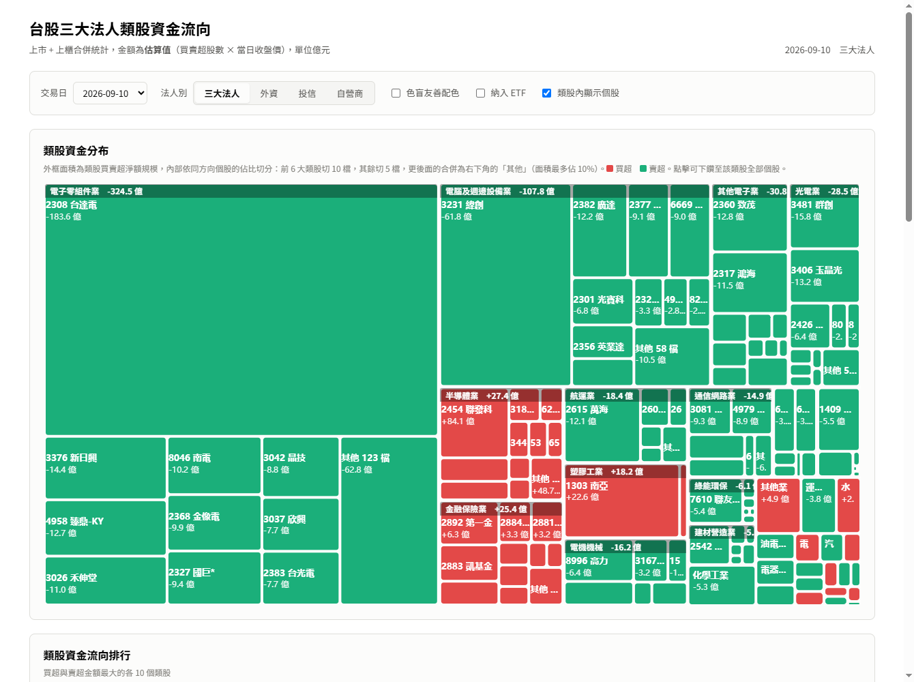
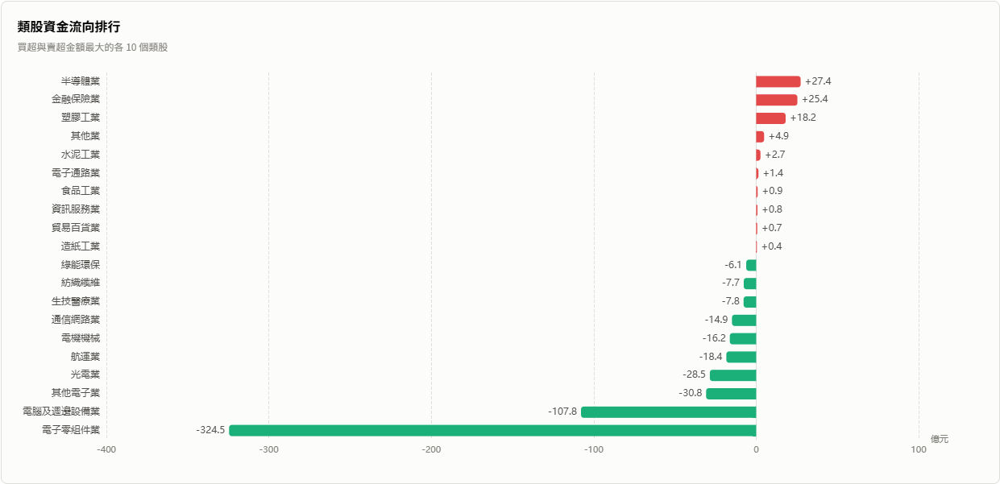
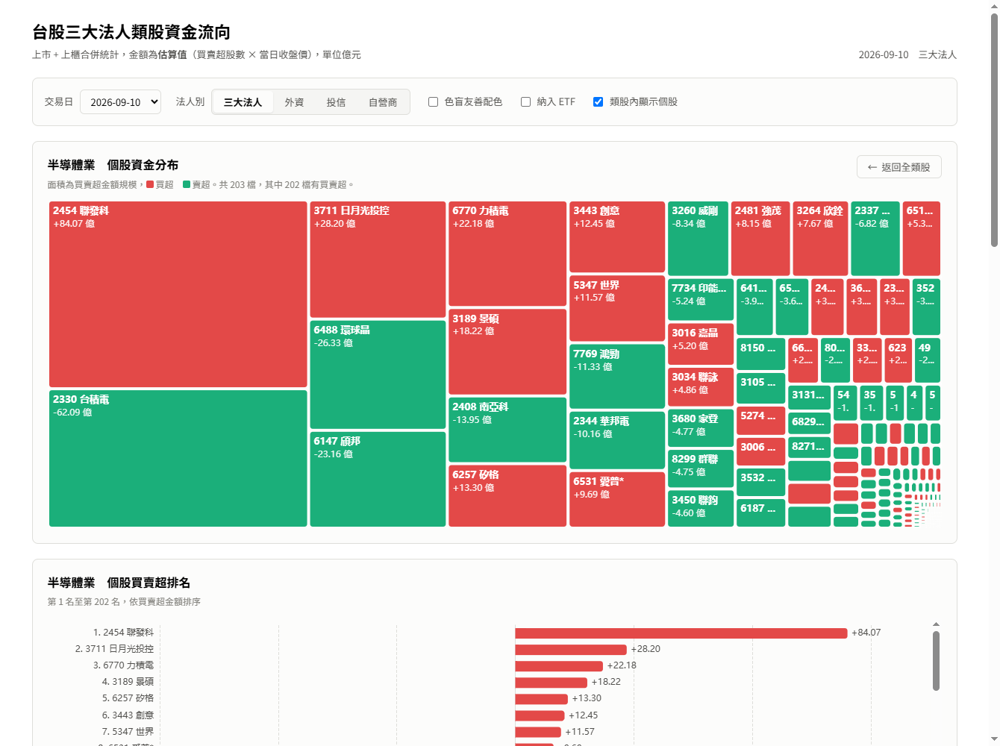
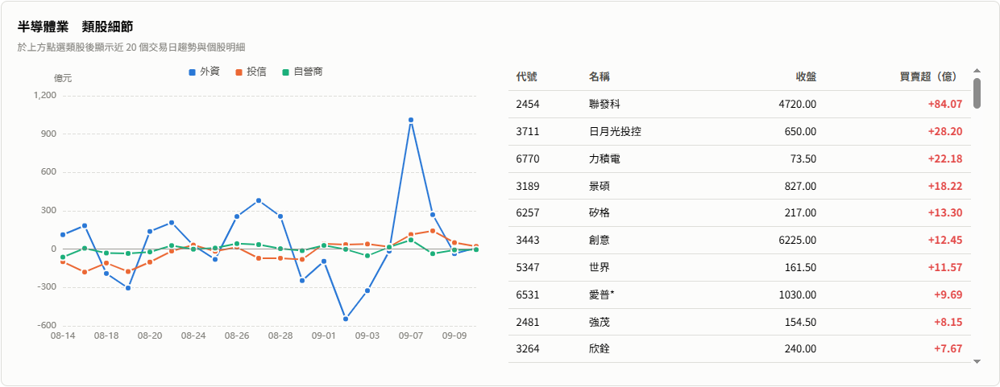

# 台股三大法人類股資金流向

每日彙整台股上市與上櫃的三大法人買賣超，依產業別聚合，呈現資金流向哪些類股。

線上版：<https://cs1dada.github.io/tw-institutional-flow/>



類股區塊的面積是買賣超淨額規模，紅色買超、綠色賣超；區塊內再依同方向個股的
佔比切分，一眼看出資金集中在哪幾檔。上圖為 2026-09-10 的電子殺盤日，
電子零組件業賣超 324.5 億中，台達電一檔就佔了 183.6 億。

## 環境需求

- Python 3.13
- 資料庫使用 SQLite，不需要另外安裝資料庫服務

## 安裝

```bash
git clone https://github.com/cs1dada/tw-institutional-flow.git
cd tw-institutional-flow
pip install -r requirements.txt
```

## 使用方式

```bash
# 1. 初始化資料庫並抓取個股主檔與產業別 (第一次執行，或每週更新一次)
python scripts/init_db.py

# 2. 匯入單日資料
python scripts/ingest_day.py 20260909
python scripts/ingest_day.py              # 不帶參數則為今日

# 3. 回補歷史資料
python scripts/backfill.py 30                    # 最近 30 個日曆日
python scripts/backfill.py 20260810 20260910     # 指定區間

# 4. 抓取主動式 ETF 持股 (需每日執行，見下方說明)
python scripts/ingest_etf.py
python scripts/ingest_etf.py 00981A 00982A       # 只抓指定幾檔

# 5. 抓取大盤指數日線 (K 線圖用，證交所以月為單位提供)
python scripts/ingest_index.py                   # 只更新當月
python scripts/ingest_index.py 120               # 回補最近 120 個月
python scripts/ingest_index.py 202101 202609     # 指定起訖年月
```

腳本可安全重複執行，已匯入的日期會自動略過，資料以 upsert 方式覆寫。

### 啟動網站

```bash
python -m uvicorn app.main:app --port 8000
```

瀏覽器開啟 <http://127.0.0.1:8000>。API 文件位於 <http://127.0.0.1:8000/docs>。

### 盤中觀察（預設關閉）

這項功能預設是關閉的，側邊欄不會出現入口，後端也不會對外送出任何請求。
要啟用請把 `app/config.py` 的 `INTRADAY_ENABLED` 改為 `True` 並重新啟動。

**關閉的原因**：MIS 是給證交所看盤網頁用的內部介面，不在官方 OpenAPI 平台上，
沒有任何公開的頻率規則可循，而[證交所使用條款](https://www.twse.com.tw/zh/page/terms/use.html)
第 6 條明文禁止未經同意的自動化擷取。實測連續掃描會讓整個 `mis.twse.com.tw`
對該 IP 停止回應達數十分鐘（連網頁本身都打不開）。

官方 OpenAPI 平台（<https://openapi.twse.com.tw/>）雖然明確歡迎介接，
但 143 個端點中沒有任何盤中即時資料，唯一帶「每 5 秒」字眼的
`/exchangeReport/MI_5MINS` 實際上是**前一交易日**的全天統計，收盤後才發布。

啟用後，側邊欄的「盤中觀察」會顯示各類股的即時強弱，約每三分鐘更新一次。
這一頁不經過資料庫，直接向證交所的 MIS 即時報價端點抓取全市場報價後在記憶體中聚合。

盤中**沒有任何官方即時法人買賣超資料**，三大法人進出要收盤後才公布，
因此這一頁改以實際成交統計呈現：

| 視覺元素 | 含意 |
|----------|------|
| 區塊面積 | 該類股開盤至今的成交金額 |
| 區塊顏色 | 該類股以成交金額加權的漲跌幅 |

成交金額以現價乘上累積成交量估算 (MIS 沒有提供累積成交金額)，與真實成交值有誤差，
用於比較類股之間的相對規模仍然成立。

這一頁**只在本機模式提供**：MIS 端點沒有 CORS 標頭，瀏覽器無法直接呼叫，
必須由後端代為抓取，因此 GitHub Pages 上的靜態站不會出現這個項目。

掃描一輪全市場需要 24 個請求。MIS 原本是給看盤頁查少數幾檔用的，
實測在半小時內送出約 200 個請求後，**整個 `mis.twse.com.tw` 會對該 IP 停止回應
達 20 分鐘以上**（連網頁本身都打不開，其他證交所端點不受影響）。

因此後端以三分鐘為快取週期，被拒絕時會自動退避（60 秒起，連續失敗加倍，
最多 30 分鐘）並沿用前一份資料。想看當下的數字可以按畫面上的「立即更新」，
但退避期間仍會沿用快取，不會真的送出請求。

這也代表這一頁**不適合多人共用同一個後端**：每多一個使用者就多一份掃描壓力。

### 匯出靜態網站

```bash
python scripts/export_static.py        # 預設匯出最近 60 個交易日
python scripts/export_static.py 30     # 只匯出最近 30 個交易日
```

把資料庫查詢結果預先算好存成 JSON 輸出到 `docs/`，供 GitHub Pages 託管。
推送後會反映在 <https://cs1dada.github.io/tw-institutional-flow/>。
資料庫仍是唯一來源，本機使用不受影響。

本機可用以下方式模擬 GitHub Pages 環境驗證：

```bash
cd docs && python -m http.server 8010
```

資料流、兩種模式的差異與設計取捨詳見 [ARCHITECTURE.md](ARCHITECTURE.md)。

### 每日自動更新

`scripts/daily_job.py` 會依序完成：個股主檔過期時重新抓取、匯入今日資料、
抓取主動式 ETF 持股、更新大盤指數日線、補抓近 7 天內只收錄到單一市場的日期。
指數在資料庫尚無任何資料時會自動回補最近 120 個月，之後每天只重抓最近兩個月。

線上的靜態網站由 GitHub Actions 每日自動更新（`.github/workflows/daily.yml`，
台灣時間週一至週五 16:40），本機不需要手動匯出與推送。

因為 Actions 會自動提交 `docs/`，**本機 push 前記得先 `git pull --rebase`**。

Windows 工作排程器設定：

- 觸發程序：每日 16:30（上市三大法人約 16:00 公布，上櫃約 15:30）
- 動作：啟動程式 `python`
- 引數：`scripts\daily_job.py`
- 起始位置：`D:\sideproject\stock`

排程若在 16:00 前執行，當日只會拿到上櫃資料，隔天執行時會自動補齊上市部分。
網站的日期選單會標示「僅上櫃」，並預設選擇最新一個兩市場都齊全的交易日。

## 資料來源

| 用途 | 來源 |
|------|------|
| 上市三大法人買賣超 | 證交所 T86 三大法人買賣超日報 |
| 上市收盤行情 | 證交所 MI_INDEX 每日收盤行情 |
| 上櫃三大法人買賣超 | 櫃買中心 三大法人買賣明細 |
| 上櫃收盤行情 | 櫃買中心 上櫃股票每日收盤行情 |
| 個股產業別 | 證交所 ISIN 有價證券代號對照表 |
| 加權指數開高低收 | 證交所 MI_5MINS_HIST 每日收盤指數歷史資料 |
| 加權指數成交量值 | 證交所 FMTQIK 每日市場成交資訊 |

皆為官方公開資料，免金鑰。

## 重要說明

### 金額為估算值

官方的個股三大法人資料**只提供買賣超股數，沒有金額**，因此本站的金額以
「買賣超股數 × 當日收盤價」估算。與官方公布的全市場買賣超金額比對
(2026-09-09 上市)：

| 法人 | 官方 | 本站估算 | 誤差 |
|------|------|----------|------|
| 外資 | 209.2 億 | 209.3 億 | 0.0% |
| 投信 | 20.8 億 | 19.8 億 | 5.2% |
| 自營商 | -18.8 億 | -14.8 億 | 21.3% |
| 合計 | 211.3 億 | 214.2 億 | 1.4% |

合計誤差約 1.4%，用於觀察類股資金流向的相對強弱足夠。自營商誤差較大，
因其買賣包含權證等已排除的標的，且絕對金額小使百分比放大。

### 統計範圍

- 收錄普通股、特別股、存託憑證、ETF 與 ETN，排除權證、受益證券與債券
- 特別股沿用母股的產業別 (例如 1101B 台泥乙特歸入水泥工業)
- ETF 與 ETN 獨立歸為「ETF」類別，不併入任何類股
- 上市與上櫃使用同一套產業分類名稱，兩市場資料合併統計

### 個股不會重複歸類

一檔股票只會被計入一個類股，各類股金額加總不會重複計算，原因如下：

1. 公開資訊觀測站的產業別本身就是一對一，台積電只屬於「半導體業」，
   不會同時出現在其他類股
2. `stock_info` 以股票代號為主鍵，一檔只存一筆產業別；聚合為
   `JOIN stock_info GROUP BY industry`，每檔只被計算一次
3. 上市與上櫃沒有代號衝突：主檔 2395 檔 = 上市 1377 + 上櫃 1018，
   總數等於分市場加總（若有相同代號互相覆蓋，總數會變少）
4. ETF 獨立成一類，不拆解為成分股。若把 0050 的買超分攤到台積電等成分股，
   會與個股本身的買賣超重複計算

以 2026-09-09 實測驗證：

| 檢查項目 | 結果 |
|----------|------|
| 一檔股票對到多個產業 | 0 筆 |
| 聚合後金額 vs 原始資料 | 227.8445 億 = 227.8445 億 |
| 參與聚合的檔數 | 2239 = 2239 |
| 有交易但主檔查不到（會被漏掉） | 0 檔 |

若存在重複歸類，聚合後金額會大於原始加總，檔數也會膨脹。

驗證方式：

```sql
-- 聚合金額應與來源完全相同
SELECT SUM(total_amt) FROM industry_daily WHERE date = '20260909';
SELECT SUM(t.total_amt) FROM inst_trade t
  JOIN stock_info s ON s.code = t.code WHERE t.date = '20260909';

-- 一檔股票對到多個產業的情況應為 0 筆
SELECT code, COUNT(*) n FROM stock_info GROUP BY code HAVING n > 1;
```

### 一對一歸屬帶來的限制

- **沒有概念股跨類統計**。「AI 概念股」「機器人概念股」橫跨半導體、電腦週邊、
  電子零組件等多個類股，官方分類沒有這種標籤，本站也沒有。若要支援，
  需自建一份股票對概念標籤的多對多對照表，該資料官方未提供
- **控股公司的歸類未必直覺**。例如日月光投控掛在「半導體業」、
  鴻海掛在「其他電子業」而非電子零組件業

### 其他

- 櫃買中心的 TLS 憑證缺少 Subject Key Identifier，Python 3.13 預設的嚴格
  X509 檢查會拒絕連線，程式中只關閉該項合規檢查，仍保留完整憑證鏈驗證
- 回補歷史時每個交易日之間間隔 3 秒，避免被證交所擋

## 專案結構

```
app/
  config.py         設定
  http_client.py    共用 HTTP 連線 (重試、TLS 相容處理)
  db.py             SQLite 連線與資料表結構
  fetchers/         各資料來源的抓取與解析
  services/         匯入流程與類股聚合
  api/              REST API
  static/           前端頁面 (ECharts 置於 static/vendor，不依賴 CDN)
scripts/            命令列腳本
data/stock.db       SQLite 資料庫
PLAN.md             實作計畫
```

## 網站功能

網站分為三個功能頁，以左側頁籤切換。頁籤下方會展開該頁各區塊的捷徑，
點擊可直接跳到對應區塊，捲動時也會標示目前所在位置。
視窗寬度在 900px 以下時只保留主頁籤，區塊捷徑會佔掉太多版面。

### 類股資金流向

| 區塊 | 內容 |
|------|------|
| 類股資金分布 | 階層式 Treemap，外框面積為類股買賣超淨額規模、顏色為買賣方向。資金規模前 14 大的類股會在區塊內依同方向個股的佔比切分：前 6 大類股切 10 檔、其餘切 5 檔，更後面的併為「其他」 |
| 類股資金流向排行 | 買超與賣超金額最大的各 10 個類股 |
| 個股下鑽檢視 | 點擊類股後，上方兩張圖切換為該類股的個股資金分布與買賣超排名（第 1 名到最後一名），按「返回全類股」回到原本檢視 |
| 類股細節 | 選定類股近 20 個交易日的外資 / 投信 / 自營商趨勢，以及當日個股明細 |
| 連續買賣超類股 | 近 10 個交易日中資金持續同方向流動的類股 |
| 個股買賣超排行 | 當日買超與賣超前 20 名 |

### 類股資金流向排行

買超與賣超金額最大的各 10 個類股，長條末端直接標示金額。



### 個股下鑽檢視

點擊任一類股，上方兩張圖會切換為該類股的個股資金分布與買賣超排名。
下圖為半導體業，當日 203 檔中有 202 檔有買賣超，第 1 名聯發科買超 84.07 億、
台積電則是最大賣超 62.09 億。



### 類股細節

選定類股近 20 個交易日的外資、投信、自營商趨勢，以及當日個股明細。



可切換法人別（三大法人 / 外資 / 投信 / 自營商）、是否納入 ETF、類股內是否顯示個股、
以及色盲友善配色。預設採台股慣例的紅買綠賣；因紅綠對色覺缺陷者辨識度較低，
所有圖表一律直接標示金額與正負號，並提供藍紅配色可切換。

類股淨額為該類股所有個股買賣相抵後的結果，因此區塊內列出的個股金額加總可能大於
類股淨額。例如某類股淨買超 27 億，但買超最多的個股就有 84 億，代表同類股內
另有大額賣超將其抵消。個股格子的面積代表其在該類股內的相對佔比，並非絕對金額。

「其他 N 檔」是該類股剩餘個股的加總，配色與同類股的個股一致（買超紅、賣超綠），
固定排在區塊右下角視為最後一名。它的面積設有上限，**最多佔該類股區塊的 10%**；超過時會把版面讓給前幾大
個股，並在 tooltip 註明「格子面積上限 10%，實際佔比更高」。未達上限的類股則
維持等比例。

上限愈低，畫面愈聚焦在具名個股，但多數大類股的「其他」會一起貼齊上限，
「資金有多分散」這個訊號就會變弱；上限值定義於 `app/static/app.js` 的
`OTHER_MAX_RATIO`，可視需要調整。

切分檔數隨類股規模分級（前 6 大切 10 檔、其餘切 5 檔），是因為小區塊切太多檔時，
個股名稱會被壓縮到只剩數字片段而無法閱讀。

### 主動式 ETF

主動式 ETF 依規定每日揭露完整持股，本頁彙整持股明細與 ETF 自身的法人買賣超。

| 區塊 | 內容 |
|------|------|
| ETF 持股變動 | 與前一交易日的快照相比，各 ETF 加碼、減碼、新進與移除了哪些個股 |
| ETF 合計持股 | 已介接的 ETF 合計持有最多的個股，市值以當日收盤價估算 |
| ETF 的法人買賣超 | 法人在市場上買賣這些 ETF 本身的金額排行，共 32 檔 |
| 已介接 ETF 持股明細 | 各檔 ETF 的完整持股，依權重排序 |

#### 兩種方向相反的資料

「ETF 的法人買賣超」與「持股」是相反方向的兩件事，不要混淆：

| 區塊 | 回答的問題 | 資金方向 | 來源與歷史 |
|------|-----------|----------|-----------|
| ETF 的法人買賣超 | 誰買了這檔 ETF？ | 流進 ETF | 證交所 T86，有完整歷史 |
| 持股 / 合計持股 / 持股變動 | 這檔 ETF 買了什麼股票？ | 流出 ETF 到個股 | 投信官網，只能逐日累積 |

ETF 的**自營商**買賣超多為參與券商的造市部位（有維持流動性的義務），
不宜視為看多看空的訊號；外資與投信的數字較接近真實的投資意圖。

#### 資料來源與限制

持股資料**沒有集中揭露平台**（證交所與投信投顧公會都只提供導覽），只能逐家投信
的官網介接。目前已完成五家、共 16 檔：

| 投信 | ETF | 資料來源與取得方式 |
|------|-----|--------------------|
| 統一 | 00403A、00411A、00981A、00988A | 申購買回清單 GetPCF，以內部基金代碼查詢 |
| 群益 | 00982A、00992A、00997A | 申購買回清單 buyback，以網站基金編號查詢 |
| 中信 | 00406A、00983A、00995A | 申購買回清單 Buyback，需先取得 AuthToken 權杖 |
| 野村 | 00980A、00985A、00999A | ETF 專區 GetFundAssets |
| 安聯 | 00402A、00984A、00993A | 交易資訊 GetFundTradeInfo，需 AntiForgery 權杖 |

尚未介接：國泰、摩根、富邦、凱基、第一金、復華、永豐、台新、元大、兆豐、聯博
（合計 16 檔）。

**這些 API 只提供最新一日的快照，沒有歷史**，因此：

- 必須每日執行 `scripts/ingest_etf.py`（已納入 `daily_job.py`）才能累積
- 「今天買了什麼」是由相鄰兩日的快照相減得出，需要累積兩日以上才有資料
- 過去的持股變動無法回補

各投信的持股基準日不一定相同（海外股票 ETF 通常晚一日），因此以 API 回傳的
基準日為準，而非抓取當天的日期。

這也表示**不能用「全體最近兩日」來比對持股變動**：若 A 檔的最新快照是 09-10、
B 檔是 09-09，直接比對會讓 A 檔的所有持股都被誤判為「新進」。因此持股相關的
查詢一律以「每檔 ETF 各自的最新快照」為準，變動也是每檔與自己的前一個快照比對。

#### 新增投信

在 `app/fetchers/etf/` 新增一個模組，實作 `fetch_holdings(etf_code)` 回傳統一
格式，再於 `app/fetchers/etf/__init__.py` 的 `ISSUERS` 與 `ETF_ISSUER` 註冊即可。
格式定義見該檔案的 docstring。

### 大盤指數

發行量加權股價指數的 K 線圖，可切換日線、週線與月線。

| 項目 | 說明 |
|------|------|
| K 棒 | 紅漲綠跌 (與類股頁同一組配色，色盲友善配色亦同步切換) |
| 均線 | 日線 MA5/MA20/MA60、週線 MA5/MA13/MA26、月線 MA6/MA12/MA24 |
| 成交量 | 副圖為成交金額 (億元)，顏色隨該根 K 棒的漲跌 |
| 區間 | 3 月、6 月、1 年、3 年、5 年、全部等快捷，或以起訖日自訂 |
| 縮放 | 可拖曳下方滑桿或以滾輪縮放 |
| 近期行情 | 區間內最後 20 根 K 棒的開高低收與漲跌幅 |

切換週期時會套用該週期的預設區間 (日線 1 年、週線 3 年、月線全部)，
但自訂區間是使用者明確指定的，切換週期時會保留。
均線一律以全部資料計算後才依區間裁切顯示，區間起點的均線不會斷頭。

資料庫只存日線，**週線與月線由前端聚合**：開盤取期初、收盤取期末、
高低取期間極值、成交金額加總。週的分界以週一為準，跨月的那一週歸屬於週一所在的週。
漲跌一律以前一根 K 棒的收盤價計算，三種週期的定義才會一致
(因此週線與月線的漲跌不會與官方的單日漲跌點數相同)。

### 前端實作備註

- ECharts 5.5.1 的 treemap `upperLabel` 在兩層資料下不會生效（試過調整 `levels`
  索引與 `leafDepth` 均無效），因此類股名稱改由程式讀取各節點的版面座標後，
  以 HTML 疊加層繪製於區塊上緣；個股標籤同步下移相同高度以避免被遮擋
- 首頁的 CSS 與 JS 帶有以檔案更新時間產生的版本參數，修改前端後瀏覽器會
  重新載入，不會沿用舊快取
- treemap 關閉 ECharts 的自動排序 (`sort: null`)，改由傳入的資料順序決定版面，
  面積大的排在左上、「其他」排在最後因而落在右下角。類股層與個股層都先依
  金額絕對值排序後再傳入；排行圖則另外依買賣超金額排序，兩者互不影響

## 配色說明

圖表色票取自經過驗證的資料視覺化調色盤：

- 買賣方向為 diverging 配色，紅（買超）對綠（賣超），中性為灰
- 三法人趨勢線使用 categorical slot 1-3（藍、橘、青），已通過色覺缺陷可辨性驗證
- 所有數值一律標示正負號，顏色不作為唯一的辨識依據
